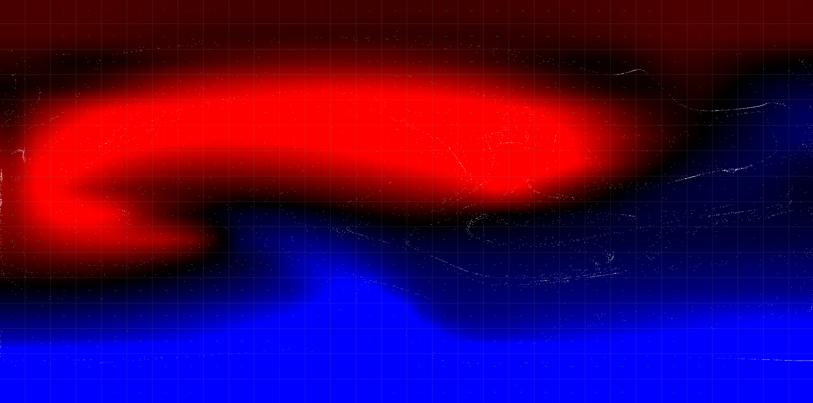

# Stable Fluids: 2D Eulerian Fluid Simulation

A Python implementation of Jos Stam's "Stable Fluids" (SIGGRAPH 1999) method, featuring a fully vectorized solver for performance. This project simulates incompressible fluid dynamics on a 2D grid, supporting real-time interaction, temperature-based buoyancy, and particle advection.



## Overview

This simulation solves the Navier-Stokes equations for incompressible flow using an Eulerian grid approach. It implements the core semi-Lagrangian advection scheme and implicit diffusion/projection steps described by Stam, ensuring stability even with large time steps.

Key features include:

-   **Stable Advection:** Semi-Lagrangian backtracing for unconditionally stable advection of velocity and scalar fields.
-   **Pressure Projection:** A Gauss-Seidel solver to enforce the incompressibility constraint (divergence-free velocity field).
-   **Buoyancy:** Temperature-driven flow (hot air rises, cold air sinks) modeled via Boussinesq approximation.
-   **Visualization:** Real-time rendering of temperature fields and velocity vectors using ModernGL (OpenGL 3.3+).

## Technical Implementation

The solver focuses on computational efficiency through **NumPy vectorization**. Instead of slow Python loops, grid operations (diffusion, advection, projection) are implemented as vectorized array operations, significantly improving performance over a naive iterative approach.

-   **Velocity & Density Step:** Solves for diffusion, advection, and mass conservation.
-   **Linear Solver:** Vectorized Gauss-Seidel relaxation for the Poisson pressure equation.
-   **Boundaries:** Handling of no-slip and free-slip conditions at domain edges.

## Usage

### Prerequisites

-   Python 3.x
-   `numpy`, `moderngl`, `moderngl-window`, `pyglm`

### Installation

```bash
git clone https://github.com/yourusername/stam-fluid-sim.git
cd stam-fluid-sim
pip install -r requirements.txt
```

### Running the Simulation

To run the fully vectorized version:

```bash
python src/fluid-vec.py
```

### Controls

-   **Mouse Drag:** Apply force/velocity to the fluid.
-   **Left/Right Click:** Add heat (red) or cold (blue) sources.
-   **V:** Toggle velocity vector field visualization.
-   **C:** Toggle temperature field visualization.
-   **G:** Toggle grid lines.
-   **P:** Reset particles.
-   **R:** Reset simulation.

## References

-   **Jos Stam**, "Stable Fluids", SIGGRAPH 1999.
-   **Jos Stam**, "Real-Time Fluid Dynamics for Games", GDC 2003.
